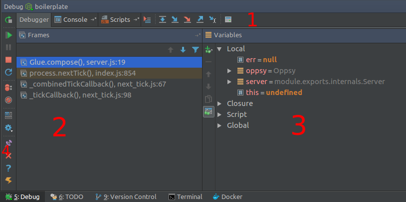
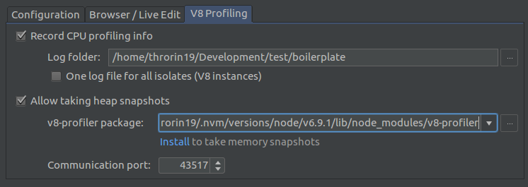
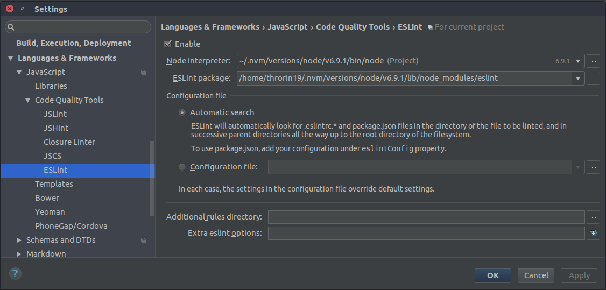

# TP 7 : Analyse, Debug et

## Lancement de son application

1. Dans la barre de lancement de votre application, cliquez sur la flèche descendante puis sur *Edit configuration*.
2. Cliquez sur l'icône **+** puis sur **Node.js**
3. Dans la ligne *Node Interpreter*, vérifiez que vous êtes bien sur la v6.9.1 sinon mettre le bon chemin (`~/.nvm/versions/node/v6.9.1/bin/node`)
4. Dans *Working directory*, ciblez votre projet
5. Dans *Javascript File*, mettez bien `server.js`.
6. Mettez le nom que vous voulez dans *Name*.
7. Validez

Vous devriez normalement vous retrouver avec ceci :

<center>

<br>
<br>
</center>

+ Le bouton *play* représenté par la flèche verte sert à lancer l'application normalement.
+ Le bouton *Debug* représenté par l'insect vert permet de lancer l'application en mode Debug.

Vous devriez voir une fenêtre s'ouvrir avec la phrase "Server running at http://127.0.0.1:8000/" ainsi que tout le dialogue propre aux routes de hapiJS.


## Mode Debug

Comme vu plus haut, vous pouvez simplement lancer votre tâche en mode Debug en cliquant sur le bouton d'insecte.

En faisant ça, si jamais votre tâche est déjà en cours d'exécution, elle sera relancée en mode debug. Et, normalement, vous devriez avoir le panneau suivant de disponible :

<center>

<br><br>
</center>

1. Bandeau de navigation permettant d'accéder aux parties suivantes :
    - `debugger` : Permet d'avoir accès au panneau de debug
    - `console` : Permet de voir le stdIn et le stdOut du programme
    - `script` : Liste des scripts rattachés au debugger
    - Les boutons de navigation au sein du code, des appels et des différents breakpoints.
2. Callstack de votre breakpoint.
3. Variables disponibles avec les valeurs courantes au moment de l'arrêt sur le breakpoint :
    - `local` : variables de la fonction en cours d'appel
    - `closure` : variables externes à la fonction mais accessibles dans celle-ci.
    - `script` : variables du fichier contenant le breakpoint.
    - `global` : obvious.
4. Boutons de contrôles.

Quand un de vos point d'arrêt est atteind par le programme, l'éditeur vous le met en évidence comme ceci :

<center>

<br><br>
</center>

Comme vous pouvez le voir, l'éditeur vous met en surimpression les valeurs des variables.

## Profiling V8

Si vous voulez essayer d'optimiser la gestion mémoire, trouver un quelconque goulot d'étranglement ou bien de savoir comment Node.JS gère l'exécution de votre programme, vous pouvez effectuer un profiling de votre projet.

Avant de commencer, vous devrez installer un module NPM en global :

```
npm install -g v8-profiler
```

Ensuite, dans la fenêtre de configuration du lancement/debug, vous devrez aller dans l'onglet `v8 profiling` et le remplir de la façon suivante :

<center>

<br><br>
</center>

Maintenant, à chaque fois que vous allez arrêter l'exécution du programme, Webstorm va vous ouvrir la fenêtre de profiling v8 correspondant à toute la durée d'exécution.

Vous trouverez la documentation complète ici : https://www.jetbrains.com/help/webstorm/2016.3/v8-cpu-and-memory-profiling.html

**Attention** : Si vous faites tourner votre programme longtemps et qu'il a beaucoup d'appels, la mémoire de base de webstorm ne sera pas suffisante à l'analyse de la heap.

## ESLint

EsLint permet de vérifier si la norme de codage est appliquée comme il faut ou non. Ceci est particulièrement utile si vous travaillez à plusieurs afin d'avoir une bonne lisibilité du code entre chacun.

Avant de commencer, vous devez installer eslint en global :

```
npm install -g eslint
```

Ensuite, afin de partir sur de bonnes bases, vous allez suivre les guidelines fournies par ArBnB disponibles ici : https://github.com/airbnb/javascript.

Afin de dire à eslint de les appliquer, vous devez installer certains modules en devDependencies :

```
npm install --save-dev eslint-config-airbnb
```

Ensuite, il faut savoir que vous devrez avoir des fichiers de configuration d'esLint dans votre projet :

- `.eslintignore` : Liste des fichiers et dossiers à ignorer.
- `.eslintrc.json` : Configuration esLint.

Voici le contenu du fichier `.eslintignore` :

```
# ignore le path de build de Backbone.js
dist/

# ignore les modules node
node_modules

# ignore les librairies externes de bower
js/libs/vendors/

# ignore les librairies externes collées dans le projet
js/libs/external

# Directory for instrumented libs generated by jscoverage/JSCover
lib-cov

# Coverage directory used by tools like istanbul
coverage

# nyc output
.nyc_output
```

Et voici le contenu de base de `.eslintrc.json`

```
{
    "env": {
        "es6": true,
        "node": true,
        "mocha": true,
        "mongo": true
    },
    "extends": "airbnb"
}
```

Pour toutes les informations complémentaires ou pour ajouter/modifier des règles, vous trouverez votre bonheur ici : http://eslint.org/

Pour finir, vous devrez, dans les paramètres de webstorm, activer esLint pour que vous soyez notifier, lors de l'édition, de ces erreurs comme mis dans la capture suivante :

<center>

<br><br>
</center>

## Pour conclure

Vous avez vu brièvement comment s'aider des différents outils à dispositions pour déceler rapidement un bug, memory leak, ... et comment produire un code de qualité et lisible par tous.

Il reste encore beaucoup de choses à dire pour cette partie et de nouveaux outils sortent tous les jours ou presque dans ce domaine.

Nous aurions aussi pu parler des tests unitaires et de la containerisation du projet sur docker pour une mise en place facilité sur vos serveurs.
